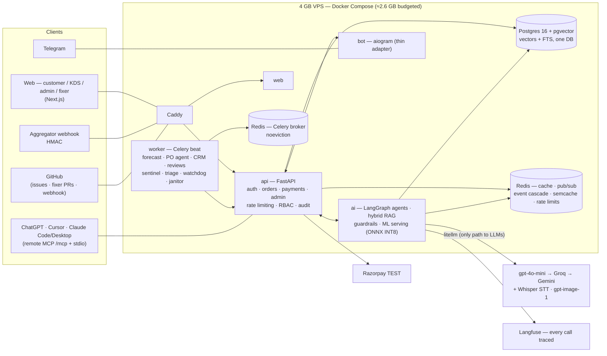
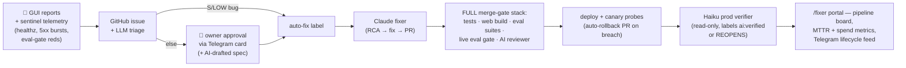

# DosaDash — AI-Native South Indian Cloud Kitchen 🥞

> A full cloud-kitchen business — customer app, Telegram bot, kitchen display, owner backoffice — where **every subsystem is AI-driven**. Built solo in 12 weeks (plus post-schedule phases) as an AI-engineering portfolio project, production-deployed on a **4 GB VPS**. It now **maintains itself**: production bug reports flow through an LLM triage → human approval → a cloud coding agent that root-causes, fixes, and ships PRs through the same eval-gated CI as a human.

**Live demo:** [dosadash.venkateshs.dev](https://dosadash.venkateshs.dev) · **[Demo guide + credentials](https://dosadash.venkateshs.dev/demo)** · Telegram: `@dosadash_bot`

One cohesive product covering: LLM apps · structured outputs · production RAG · agentic AI (LangGraph) · MCP · fine-tuning (LoRA) · embeddings/vector search · classical ML (XGBoost) · recommenders · speech (Whisper) · vision (VLM) · image generation · **LLM evals as CI merge gates** · guardrails · LLMOps (Langfuse) · **an autonomous self-healing SDLC loop** (sentinel → triage → fixer → AI review → canary deploy → prod verification).

## Architecture



Key structural choices: pgvector keeps vectors + full-text search in the business DB (no second datastore to drift); every business-state mutation publishes to Redis pub/sub and the AI layer subscribes (menu edit → RAG re-embed + cache flush — the agent can never sell a dish that was just 86'd); the Telegram bot and MCP server are thin adapters over the **same** agent graph and the **same** order service that the web uses.

## The self-healing loop

Since Phase 13 the platform runs an autonomous maintenance loop — the same merge gates that block human regressions also gate the machine's own fixes:



Everything is deterministic where it matters: the LLM *observes* (triage assessment), policy code *decides* (SYSTEM reports and HIGH-risk/M-effort changes can never auto-fix; autonomy is an **earned ladder** unlocked by measured verification rates); hard limits (migrations, workflows, secrets) escalate to a human; a dispatch watchdog survives GitHub Actions outages. **The loop has closed for real in production**: the fixer RCA'd and shipped a React hydration bug fix (8 lines) and built a customer-facing feature (high-protein menu filter) — both passed the live eval gate, were human-approved via Telegram, deployed, and verified live.

## Measured results

All LLM paths are eval-gated in CI; classical-ML numbers are measured against committed benchmark artifacts. Data is synthetic with planted signal (personas, festival multipliers) — noted where it matters.

| System | Result | Measured how |
|---|---|---|
| **Order agent** | **97.1% order accuracy · 100% tool correctness · 0 guardrail bypasses** | 175-conversation live golden set (EN / Hinglish / Tanglish / Tamil script, 45 safety-tagged cases, voice, sold-out, allergens, serving windows) — **CI merge gate at ≥ 95%**, caught two real regressions pre-merge (85%, 92.7%) |
| Tamil ordering | lang_accuracy **1.00** (per-language gate ≥ 0.80) | 11 Tamil-script cases riding the translation-alias mechanism — the agent prompt needed zero Tamil-specific changes |
| Demand forecast (XGBoost) | **WAPE 0.421 vs 0.555 naive lag-7** (−24%) | per-dish 14-day recursive backtest; MLflow champion promoted only on improvement |
| Delivery ETA | **MAE 3.35 min** (synthetic noise floor: oracle 3.32) · P90 6.84 vs 7.00 | held-out delivered orders |
| Recommender (implicit ALS) | **Recall@10 0.387 vs 0.352 popularity** · tail-Recall@10 **0.304 vs 0.000** | v4, retrained on the 60-dish highway catalog; the tail number is the story: popularity can't recommend the long tail at all |
| Checkout combo suggester | attach 15.7% vs 13.3% random · **AOV +4.5% vs control** | 3-arm simulated A/B on 3,133 holdout checkout sessions (validates taste recovery, not real-world uplift — caveat in the artifact) |
| Review sentiment (LoRA DistilBERT) | **macro-F1 0.9944 vs 0.9926 gpt-4o-mini zero-shot** on the same 250-review holdout · **₹0 vs ₹3.20 per 1k reviews** | INT8 ONNX serves on-VPS CPU: ~57 ms/review, 97.2% confident coverage @ 0.9968 macro-F1; unconfident residue falls back to the LLM (nightly via Batch API at 50% price) |
| Invoice OCR (VLM) | structured extraction + deterministic arithmetic verifier + PO matching | confidence ≥ 0.8 pre-checks the review queue; a human always approves before stock moves |
| Prompt caching | **48.9% cached-token share** measured in prod | provider `cached_tokens` counters over live agent calls (stable-prefix strategy) |
| Load (single-process api) | **100 concurrent users · 0 failures · P50 24 ms / P95 210 ms** · checkout P95 370 ms · **prod (4 GB VPS, TLS, limiter on): 0 failures, P50 41 ms / P95 140 ms** | locust, 91 real end-to-end orders locally + off-peak run against production; rate limiter shed abusive traffic while served P50 held ([details](infra/loadtest/results.md)) |
| Test suite | **889 tests + 159 key-free eval-asset gates** | plus the live eval gate on every PR touching AI paths |

## What's inside

- **Conversational ordering** (web chat, Telegram text + voice notes in EN/Tamil) on one LangGraph agent: structured `OrderDraft` output, every item DB-validated (**hallucinated dishes cannot reach checkout**), SSE streaming, prompt-caching-friendly stable prefix, "my usual" episodic memory, one-round self-correction on contradiction signatures.
- **A real menu with serving windows**: 60 dishes researched from actual Chennai–Trichy highway kitchens (millet specials, non-veg mess meals), every dish on a per-day schedule ("Dosa is not available at lunch") enforced end-to-end — menu annotation, checkout 409, greyed cards, and an agent that explains the window deterministically instead of hallucinating refusals.
- **Production RAG** over the knowledge base: BM25 + vector RRF → LLM rerank → citations; semantic cache with measured hit rate; re-embed cascade on menu events.
- **Agents with deterministic guardrails**: inventory agent (forecast-driven draft POs → owner approval via Telegram), support agent (refunds *never* agent-executed — human escalation inbox), promo agent, text-to-SQL analytics copilot (read-only DB role, SQL allowlist, self-correction).
- **The self-healing SDLC loop**: 🐞 GUI reports + a production sentinel (healthz fleet probes, 5xx-burst detection, consecutive eval-gate reds) → GitHub issues → LLM triage (`feedback_triage_v2`) → Telegram approval cards (with an AI-drafted spec for features) → a Claude fixer that RCAs and opens PRs through the **full merge-gate stack** (incl. an independent AI reviewer on a different model) → deploy canary with mechanical auto-rollback PRs → a read-only Haiku verifier that probes the fix live and labels `ai:verified` or reopens → `/fixer` portal with pipeline board, honest funnel metrics (MTTR, verification rate, agent spend), and a dispatch watchdog that survives GitHub Actions outages.
- **Evals as infrastructure**: golden sets are versioned assets with coverage-floor gates; order accuracy / tool correctness / guardrail bypass / RAG faithfulness / tone (LLM-as-judge) + per-language floors; results land in an `eval_runs` table with an admin scoreboard; a weekly janitor computes the flaky-case list from real run history.
- **Classical ML with honest baselines**: every model must beat its naive baseline to be promoted (and the losses are documented — raw-count ALS *lost* to popularity until log1p confidences fixed it).
- **Multimodal**: Whisper voice ordering, VLM dish-photo QC (model observes, verdict computed deterministically), VLM invoice OCR, `gpt-image-1` menu photos behind owner approval with a permanent ✨ AI label.
- **Tamil localization served live**: LLM-drafted translations behind owner approval (stale translations auto-reset on menu edits), EN/தமிழ் web toggle, translated names feeding the agent as aliases with a byte-identical-context invariant.
- **"Madras Pop" design system**: indigo/magenta/turmeric identity across all six surfaces (customer, orders, KDS, admin, `/demo`, `/fixer`), self-hosted fonts, visual-only discipline (zero contract changes across two full redesigns).
- **Ops discipline**: rate limiting (fail-open), PII redaction before any LLM call, secrets in env only, Razorpay TEST keys, conventional commits, phase branches → protected `main` = production deploy, postmortem-driven fixes (nice-to-have mounts degrade, never crash checkout).

## Repository layout

```
apps/api        Core FastAPI (auth, menu, orders, payments, admin, feedback spine, rate limiting)
apps/ai         AI service (agents, RAG, guardrails, MCP server, ML inference, triage)
apps/bot        aiogram Telegram adapter (thin — no business logic)
apps/web        Next.js — customer / + KDS /kds + admin /admin + demo /demo + fixer portal /fixer
packages/ml     datagen, forecasting, recsys, LoRA fine-tune (+ committed benchmark artifacts)
packages/shared Pydantic schemas shared across services
evals/          golden datasets, live suites, LLM-as-judge rubrics, key-free asset gates
knowledge/      RAG source markdown (recipes, allergens, FAQs, policies, serving hours)
design/         Madras Pop design system (tokens, mockups, renders)
infra/          docker-compose, Caddyfile, deploy scripts, locust load tests
.github/        CI, live eval gate, UI smoke, deploy + canary, Claude fixer/spec/review/verify workflows
```

## Run it locally

```bash
# infra: Postgres (pgvector) + Redis
docker run -d --name pg -e POSTGRES_USER=dosadash -e POSTGRES_PASSWORD=dosadash \
  -e POSTGRES_DB=dosadash -p 5432:5432 pgvector/pgvector:pg16
docker run -d --name redis -p 6379:6379 redis:7-alpine

uv sync --all-packages --all-extras --group dev
cd apps/api && uv run alembic upgrade head && uv run python -m dosadash_api.seed
uv run uvicorn dosadash_api.main:app --port 8000           # api
# apps/ai + apps/bot analogous (LLM keys via env; see .env.example files)
cd apps/web && npm install && npm run dev                  # web on :3000

uv run pytest apps packages -q      # 889 tests
uv run pytest evals -q              # key-free eval-asset gates
```

## Documentation

| File | Contents |
|---|---|
| [docs/01-plan-overview.md](docs/01-plan-overview.md) | Goals, risks, cost budget, as-built outcome |
| [docs/02-architecture.md](docs/02-architecture.md) | Full architecture, services, memory budget, self-healing loop |
| [docs/03-feature-ai-matrix.md](docs/03-feature-ai-matrix.md) | Feature ↔ AI-concept mapping |
| [docs/04-business-usecases.md](docs/04-business-usecases.md) | Customer + owner use cases |
| [docs/05-schedule-12-weeks.md](docs/05-schedule-12-weeks.md) | Phase-by-phase build schedule (+ post-schedule phases) |
| [docs/06-schema.md](docs/06-schema.md) | DB schema (Postgres + pgvector + Redis keyspaces) |
| [docs/07-resume-bullets.md](docs/07-resume-bullets.md) | Resume bullets with the measured numbers |
| [docs/08-git-workflow.md](docs/08-git-workflow.md) | Phase branches → protected `main` (= prod), PR gates |
| [docs/09-mcp-demo.md](docs/09-mcp-demo.md) | MCP everywhere: ChatGPT / Cursor / Claude Code / Claude Desktop order a dosa (remote Streamable HTTP + admin-issued keys) |
| [docs/10-demo-video-script.md](docs/10-demo-video-script.md) | 3-minute demo video, shot-by-shot |
| [docs/11-blog-post.md](docs/11-blog-post.md) | Blog draft: "Evals Are Merge Gates" |
| [docs/13-ui-madras-pop-design.md](docs/13-ui-madras-pop-design.md) | Madras Pop design system spec |
| [docs/14-self-healing-loop.md](docs/14-self-healing-loop.md) | Self-healing loop design + ops runbook |
| [docs/15-sdlc-loop.md](docs/15-sdlc-loop.md) | SDLC loop v2: sentinel, autonomy ladder, canary, spec lane |
| [infra/loadtest/results.md](infra/loadtest/results.md) | Load-test method + measured results |

## Stack

Python 3.12 · FastAPI · Pydantic v2 · SQLAlchemy 2 async · PostgreSQL 16 + pgvector · Redis · Celery · LangGraph · litellm (gpt-4o-mini → Groq `gpt-oss-120b` → Gemini Flash) · OpenAI embeddings · Groq Whisper · gpt-image-1 · XGBoost · implicit ALS · DistilBERT + LoRA → INT8 ONNX · MLflow · Langfuse · Next.js + Tailwind · aiogram · Docker Compose · Caddy · GitHub Actions · claude-code-action (fixer / spec / review / verify).
