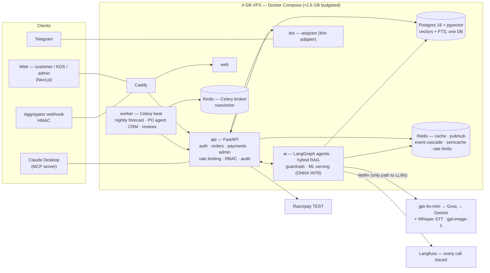

# DosaDash — AI-Native South Indian Cloud Kitchen 🥞

> A full cloud-kitchen business — customer app, Telegram bot, kitchen display, owner backoffice — where **every subsystem is AI-driven**. Built solo in 12 weeks as an AI-engineering portfolio project, production-deployed on a **4 GB VPS**.

**Live demo:** [dosadash.venkateshs.dev](https://dosadash.venkateshs.dev) · **[Demo guide + credentials](https://dosadash.venkateshs.dev/demo)** · Telegram: `@dosadash_bot`

One cohesive product covering: LLM apps · structured outputs · production RAG · agentic AI (LangGraph) · MCP · fine-tuning (LoRA) · embeddings/vector search · classical ML (XGBoost) · recommenders · speech (Whisper) · vision (VLM) · **LLM evals as CI merge gates** · guardrails · LLMOps (Langfuse).

## Architecture



Key structural choices: pgvector keeps vectors + full-text search in the business DB (no second datastore to drift); every business-state mutation publishes to Redis pub/sub and the AI layer subscribes (menu edit → RAG re-embed + cache flush — the agent can never sell a dish that was just 86'd); the Telegram bot and MCP server are thin adapters over the **same** agent graph and the **same** order service that the web uses.

## Measured results

All LLM paths are eval-gated in CI; classical-ML numbers are measured against committed benchmark artifacts. Data is synthetic with planted signal (personas, festival multipliers) — noted where it matters.

| System | Result | Measured how |
|---|---|---|
| **Order agent** | **96.4% order accuracy · 100% tool correctness · 0 guardrail bypasses** | 168-conversation live golden set (EN / Hinglish / Tanglish / Tamil, adversarial, sold-out, allergens) — **CI merge gate at ≥ 95%**, caught two real regressions pre-merge (85%, 92.7%) |
| Tamil ordering | lang_accuracy **1.00** (per-language gate ≥ 0.80) | 10 Tamil-script cases riding the translation-alias mechanism — zero prompt changes needed |
| Demand forecast (XGBoost) | **WAPE 0.421 vs 0.555 naive lag-7** (−24%) | per-dish 14-day recursive backtest; MLflow champion promoted only on improvement |
| Delivery ETA | **MAE 3.35 min** (synthetic noise floor: oracle 3.32) · P90 6.84 vs 7.00 | held-out delivered orders |
| Recommender (implicit ALS) | **Recall@10 0.417 vs 0.378 popularity** · tail-Recall@10 **0.345 vs 0.000** | the tail number is the story on a 52-item catalog: popularity can't recommend the long tail at all |
| Checkout combo suggester | attach 15.6% vs 12.8% random · **AOV +4.9% vs control** | 3-arm simulated A/B on 3,273 holdout checkouts (validates taste recovery, not real-world uplift — caveat in the artifact) |
| Review sentiment (LoRA DistilBERT) | **macro-F1 0.9944 vs 0.9926 gpt-4o-mini zero-shot** on the same 250-review holdout · **₹0 vs ₹3.20 per 1k reviews** | INT8 ONNX serves on-VPS CPU: ~57 ms/review, 97.2% confident coverage @ 0.9968 macro-F1; unconfident residue falls back to the LLM (nightly via Batch API at 50% price) |
| Invoice OCR (VLM) | structured extraction + deterministic arithmetic verifier + PO matching | confidence ≥ 0.8 pre-checks the review queue; a human always approves before stock moves |
| Load (single-process api) | **100 concurrent users · 0 failures · P50 24 ms / P95 210 ms** · checkout P95 370 ms | locust, 91 real end-to-end orders; rate limiter shed 343 abusive reqs while served P50 held 17 ms ([details](infra/loadtest/results.md)) |
| Test suite | **683 tests + 115 key-free eval-asset gates** | plus the live eval gate on every PR touching AI paths |

## What's inside

- **Conversational ordering** (web chat, Telegram text + voice notes in EN/Tamil) on one LangGraph agent: structured `OrderDraft` output, every item DB-validated (**hallucinated dishes cannot reach checkout**), SSE streaming, prompt-caching-friendly stable prefix, "my usual" episodic memory.
- **Production RAG** over the knowledge base: BM25 + vector RRF → LLM rerank → citations; semantic cache (measured hit rate on the admin dashboard); re-embed cascade on menu events.
- **Agents with deterministic guardrails**: inventory agent (forecast-driven draft POs → owner approval via Telegram), support agent (refunds *never* agent-executed — human escalation inbox), promo agent, text-to-SQL analytics copilot (read-only DB role, SQL allowlist, self-correction).
- **Evals as infrastructure**: golden sets are versioned assets with coverage-floor gates; order accuracy / tool correctness / guardrail bypass / RAG faithfulness / tone (LLM-as-judge); results land in an `eval_runs` table with an admin scoreboard.
- **Classical ML with honest baselines**: every model must beat its naive baseline to be promoted (and the losses are documented — raw-count ALS *lost* to popularity until log1p confidences fixed it).
- **Multimodal**: Whisper voice ordering, VLM dish-photo QC (model observes, verdict computed deterministically), VLM invoice OCR, `gpt-image-1` menu photos behind owner approval with a permanent ✨ AI label.
- **Ops discipline**: rate limiting (fail-open), PII redaction before any LLM call, secrets in env only, Razorpay TEST keys, conventional commits, phase branches → protected `main` = production deploy, postmortem-driven fixes (nice-to-have mounts degrade, never crash checkout).

## Repository layout

```
apps/api        Core FastAPI (auth, menu, orders, payments, admin, rate limiting)
apps/ai         AI service (agents, RAG, guardrails, MCP server, ML inference)
apps/bot        aiogram Telegram adapter (thin — no business logic)
apps/web        Next.js — customer / + KDS /kds + admin /admin + demo guide /demo
packages/ml     datagen, forecasting, recsys, LoRA fine-tune (+ committed benchmark artifacts)
packages/shared Pydantic schemas shared across services
evals/          golden datasets, live suites, LLM-as-judge rubrics, key-free asset gates
knowledge/      RAG source markdown (recipes, allergens, FAQs, policies)
infra/          docker-compose, Caddyfile, deploy scripts, locust load tests
```

## Run it locally

```bash
# infra: Postgres (pgvector) + Redis
docker run -d --name pg -e POSTGRES_USER=dosadash -e POSTGRES_PASSWORD=dosadash \
  -e POSTGRES_DB=dosadash -p 5432:5432 pgvector/pgvector:pg16
docker run -d --name redis -p 6379:6379 redis:7-alpine

uv sync --all-packages --all-extras --group dev
cd apps/api && uv run alembic upgrade head && uv run python -m dosadash_api.seed
uv run uvicorn dosadash_api.main:app --port 8000           # api
# apps/ai + apps/bot analogous (LLM keys via env; see .env.example files)
cd apps/web && npm install && npm run dev                  # web on :3000

uv run pytest apps packages -q      # 683 tests
uv run pytest evals -q              # key-free eval-asset gates
```

## Documentation

| File | Contents |
|---|---|
| [docs/01-plan-overview.md](docs/01-plan-overview.md) | Goals, risks, cost budget |
| [docs/02-architecture.md](docs/02-architecture.md) | Full architecture, services, memory budget |
| [docs/03-feature-ai-matrix.md](docs/03-feature-ai-matrix.md) | Feature ↔ AI-concept mapping |
| [docs/04-business-usecases.md](docs/04-business-usecases.md) | Customer + owner use cases |
| [docs/05-schedule-12-weeks.md](docs/05-schedule-12-weeks.md) | Phase-by-phase build schedule |
| [docs/06-schema.md](docs/06-schema.md) | DB schema (Postgres + pgvector + Redis keyspaces) |
| [docs/07-resume-bullets.md](docs/07-resume-bullets.md) | Resume bullets with the measured numbers |
| [docs/08-git-workflow.md](docs/08-git-workflow.md) | Phase branches → protected `main` (= prod), PR gates |
| [docs/09-mcp-demo.md](docs/09-mcp-demo.md) | Claude Desktop orders a dosa via MCP |
| [infra/loadtest/results.md](infra/loadtest/results.md) | Load-test method + measured results |

## Stack

Python 3.12 · FastAPI · Pydantic v2 · SQLAlchemy 2 async · PostgreSQL 16 + pgvector · Redis · Celery · LangGraph · litellm (gpt-4o-mini → Groq `gpt-oss-120b` → Gemini Flash) · OpenAI embeddings · Groq Whisper · XGBoost · implicit ALS · DistilBERT + LoRA → INT8 ONNX · MLflow · Langfuse · Next.js + Tailwind · aiogram · Docker Compose · Caddy · GitHub Actions.
